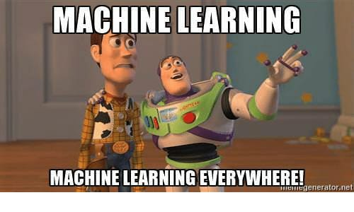

# Advanced regression and multilevel models

**Learning objective:**

- Introduction to other methods not covered in detail in this book
 
## Expressiong the models so far in a common framework

Much can be done with the basic model:

$$
y = X\beta + \epsilon
$$

* Maximum likelihood for point estimation
* Including priors (regularization)
* Sampling the posterior to include uncertainty
* Forecasting including predictive uncertainty
* Additive nonlinear models (e.g. polynomials)

## Incomplete data 

Imputing missing data was covered in Chapter 17, but there areother types of incomplete data, for example:

* Survival analysis / Censoring - See for example [Introduction to Statistical Learning](https://www.statlearning.com/) for more on this.
* Measurement error:
   * Errors in $y$ can be folded into the error term
   * Errors in $x$ are more challenging, mathematics similar to *instrumental* variables of chapter 21.  Book has references for more.
   
## Correlated errors

This book assumes uncorrelated errors, but this can be generalized to considered correlated /structured errors. Examples include:

* Time series
* Spatial correlation
* Networks / Graphs
* Factor analysis

## Many Predictors

* Often we want to include a large number of predictors, e.g. to make ignorability more plausible.
* Challenge is to avoid overfitting leading to increased variance and uncertainty in the estimations. If you cannot reduce the parameters some options include:
   * Combine (related) predictors in a structured way
   * Regularization, e.g. informative priors, horseshoe (breifly mentioned in Chapter 11) and lasso.
   
## Multilevel or hierachical models

* Can often make sense to allow regression coefficients to vary by group, which can be included by simply incuding the group as a factor in the model:

``` 
stan_glm(y ~ x + factor(state) + x:factor(state),... )
```

* When number of observations per group is small, consider instead multlevel regression which is a method of partially pooling the varying coefficients.  See for example [Bayes Rules](https://www.bayesrulesbook.com/) or [Baysian Data Analysis](http://www.stat.columbia.edu/~gelman/book/). There is also supposed to be second volume to follow this one, called [Applied Regression and Multilevel Models](http://www.stat.columbia.edu/~gelman/armm/), but  seems to be stalled.

## Nonlinear models

* Often nonlinear models cannot be expressed in terms of linear predictors. 

* Stan can fit these models!  

* See demo 'Golf' [tidy-ros](https://github.com/behrman/ros)
 
## Nonparametric regression and machine learning



* *Nonparamentric regression* -  the regression curve is not constrained to follow any particular parametric form. 

* *Machine Learning* describes nonparametric regression where the focus is more on prediction rather then parameter estimation.

* To avoid overfitting, nonparametric models use a variety of techniques to constrain the model and Tuning parameters (hyperparameters) govern the amount of constraint, typically optimized using cross-validation.

* Some examples of nonparametric models:

   * *Loess* - locally weighted regression, tuned by the stength of the weight function.
   
   * *splines* - nonlinear basis functions , tuning controls the 'local smoothness'
   
   * *Gaussian processes* - multivariate Gaussian model, tuning controls the correlation distance
   
   * *Tree models* - Decision trees are very powerful nonparametric models, especially gradient boosted trees (e.g. [XGBoost](https://xgboost.readthedocs.io/en/stable/)).
   
   * *BART* - Bayesian additive regression trees. Somehow includes priors over trees and leaf values. For more, ROS recommends: [Bayesian Additive Regression Trees: A Review and Look Forward](https://www.annualreviews.org/doi/abs/10.1146/annurev-statistics-031219-041110)
   
* Many of these methods are covered or at least introduced in [Introduction to Statistical Learning](https://www.statlearning.com/)

## Machine learning meta-algorithms {-}

  * *Meta-algorithms* - build flexible models small interchangeable components
     * Ensemble learning - average over multiple models 
     * Deep learning - combine simple (differentiable) models into larger more flexible models.
     * Genetic algorithms - "evolve" models
   

* Linear and logistic regression make *strong* assumptions that allow us to *summarize* small data sets.  Bayeisan inference an allow even strong statements on parameter uncertainty. 

* Machine learning meta-algorithms supply very little structure ('inductive bias') and provide maximum flexibility for problems where *enough data* is available to support it.
 
## Computational efficency in Stan

* Stan uses "Hamiltonian Monte Carlo" by default, which produces a random walk in parameter space.

   * This is an *iterative* and *stochastic* process. 

   * By default produced 4000 draws as 1000 draws in 4 chains. 
   
   * Diagnostics can help evaluate the simulation:
      * R-hat - compares different chains. If not near 1 then the chains have not fully mixed.
      * N_eff - the effective number of samples (samples are correlated due to iterative nature of the simulations.).  'Usually' n_eff > 400 is sufficient.
      * mcse - "Monte carlo standard error" - additional uncertainty due to the stochastic algorithm, negligable in all examples in this book.
      
* With larger and more complex data sets and / or predictors, computation speed can be a limiting factor. Some options:
      
  * Parallel processing - rstan can take advantage of multiple processors if they are available. `options(mc.cores = parallel::detectCores())` 

  * Mode-based approximations - `stan_glm` can be made as fast as `glm` while retaining the advantages of Bayesian inference by approximating the full Bayesian calculation. One method ("optimizing") uses a normal approximation centered at the posterior mode.  
  
  * See demo 'Scalability' [tidy-ros](https://github.com/behrman/ros) 
  
 
* Other ('Variational inference') algorithms are available but beyond the scope fo this book.


## The End


## Meeting Videos

<!--
### Cohort 2

`r knitr::include_url("https://www.youtube.com/embed/URL")`

<details>
<summary> Meeting chat log </summary>

```
LOG
```
</details>
-->
